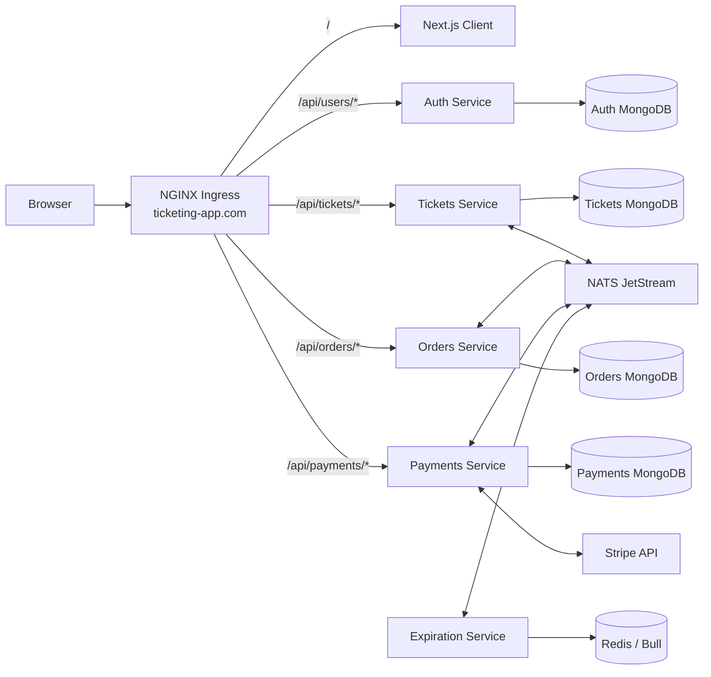

# VenuePass

VenuePass is an event-ticket marketplace built as a distributed microservices application. Users can create accounts, publish ticket listings, browse available tickets, reserve a ticket through a time-limited order, and initiate payment through Stripe.

The project combines a Next.js frontend with independently deployable Node.js services, database-per-service persistence, NATS JetStream event delivery, Redis-backed order expiration, and Kubernetes orchestration through Skaffold.

## Table of Contents

- [Project Status](#project-status)
- [Features](#features)
- [Architecture](#architecture)
- [Services and Components](#services-and-components)
- [Core Workflows](#core-workflows)
  - [Authentication](#authentication)
  - [Ticket Listing](#ticket-listing)
  - [Order Reservation](#order-reservation)
  - [Order Expiration](#order-expiration)
  - [Payment Completion](#payment-completion)
  - [Late Payment and Refund Handling](#late-payment-and-refund-handling)
- [Event-Driven Communication](#event-driven-communication)
- [Technology Stack](#technology-stack)
- [Repository Structure](#repository-structure)
- [API Overview](#api-overview)
- [Data Ownership](#data-ownership)
- [Shared Package](#shared-package)
- [Reliability and Consistency](#reliability-and-consistency)
- [Security](#security)
- [Prerequisites](#prerequisites)
- [Package Registry and Certificates](#package-registry-and-certificates)
- [Configuration](#configuration)
  - [Kubernetes Secrets](#kubernetes-secrets)
  - [Environment Variables](#environment-variables)
- [Running the Complete Project](#running-the-complete-project)
- [Stripe Webhook Setup](#stripe-webhook-setup)
- [Kubernetes Resources](#kubernetes-resources)
- [Health Checks](#health-checks)
- [Local Service Development](#local-service-development)
- [Available Scripts](#available-scripts)
- [Testing](#testing)
- [Docker and Skaffold](#docker-and-skaffold)
- [Troubleshooting](#troubleshooting)
- [Known Limitations](#known-limitations)
- [Service Documentation](#service-documentation)
- [License](#license)

## Project Status

The repository contains working implementations for:

- cookie-based user registration, sign-in, sign-out, and current-user lookup;
- ticket creation, retrieval, pagination, and seller-owned ticket updates;
- time-limited order creation, retrieval, listing, cancellation, and seller order lookup;
- asynchronous ticket reservation and release;
- Stripe PaymentIntent creation;
- signed Stripe webhook processing;
- payment completion, cancellation race handling, and idempotent refunds;
- Redis/Bull-based order expiration;
- durable NATS JetStream consumers and shared event contracts;
- Kubernetes deployments, services, ingress routing, health probes, and single-node MongoDB replica-set initialization;
- Skaffold-based image building, deployment, and source synchronization.

The frontend is functional for authentication, ticket browsing, ticket creation, order creation, countdown, cancellation, and initial payment interaction. Some client views and payment-confirmation behavior remain incomplete; see [Known Limitations](#known-limitations).

## Features

### Marketplace

- Public VenuePass landing page.
- Browse tickets ordered by upcoming event date.
- Search, filter, sort, and progressively reveal listings in the client.
- View ticket details, venue information, price, category, event type, and optional media.
- Create one or multiple ticket records from quantity or seat allocations.
- Restrict ticket edits to the listing owner.
- Prevent editing tickets that are reserved or sold.

### Orders

- Reserve a ticket through an authenticated order.
- Prevent multiple active orders for the same ticket.
- Maintain a 15-minute order expiration window.
- List a buyer's orders with newest orders first.
- Allow order owners to cancel non-terminal orders.
- Allow a ticket seller to inspect the active order associated with their ticket.

### Payments

- Create Stripe PaymentIntents using the server-side Stripe SDK.
- Reuse an active PaymentIntent for repeated requests.
- Use Stripe idempotency keys for payment attempts and refunds.
- Verify webhook signatures before processing payment events.
- Deduplicate webhook deliveries by Stripe PaymentIntent ID.
- Publish payment-cleared events only once, while safely retrying an interrupted publish.
- Refund payments that complete after an order was cancelled or expired.

### Platform and Operations

- Independent services and databases.
- NATS JetStream event stream with durable consumers.
- Explicit message acknowledgement and retry behavior.
- Redis-backed delayed expiration jobs.
- Kubernetes startup, readiness, and liveness probes.
- Graceful shutdown for services connected to MongoDB, NATS, and Redis.
- Shared TypeScript contracts and middleware through `@venuepass/common`.

## Architecture



### Architectural principles

- **Database per service:** each stateful backend owns its MongoDB data and does not query another service's database.
- **Asynchronous replication:** services maintain the local data required for decisions by consuming domain events.
- **Choreographed workflow:** no central saga orchestrator controls the order lifecycle. Services react to published events.
- **Same-origin browser API:** the frontend calls relative `/api/*` paths, and NGINX Ingress routes requests to the correct service.
- **Shared contracts:** event payloads, enums, authentication middleware, health state, and error types are published through `@venuepass/common`.

## Services and Components

| Component       | Responsibility                                                                                        | Persistent dependency       | Event role                                                                     |
| --------------- | ----------------------------------------------------------------------------------------------------- | --------------------------- | ------------------------------------------------------------------------------ |
| `client`        | Next.js web interface, server-rendered authentication checks, marketplace and checkout UI             | None                        | Uses HTTP APIs only                                                            |
| `auth`          | User registration, credentials, JWT creation, cookie sessions, current-user lookup                    | Auth MongoDB                | None                                                                           |
| `tickets`       | Ticket listings, seller updates, reservation status, ticket availability                              | Tickets MongoDB             | Publishes ticket events; consumes order events                                 |
| `orders`        | Buyer orders, reservation window, lifecycle transitions, local ticket replicas                        | Orders MongoDB              | Publishes order/refund events; consumes ticket, expiration, and payment events |
| `payments`      | Stripe PaymentIntents, webhook verification, payment records, refunds, local order replicas           | Payments MongoDB and Stripe | Publishes payment events; consumes order/refund events                         |
| `expiration`    | Schedules and executes delayed order-expiration jobs                                                  | Redis                       | Consumes order-created; publishes expiration-complete                          |
| `common`        | Shared server/client contracts, errors, middleware, event base classes, JetStream setup, health state | Private npm registry        | Defines all event subjects and payloads                                        |
| `nats-test`     | Standalone publisher/listener experimentation utility                                                 | NATS                        | Development/testing utility only                                               |
| `infra/k8s`     | Kubernetes deployments, services, ingress, databases, NATS, Redis, and initialization jobs            | Kubernetes                  | Platform configuration                                                         |
| `skaffold.yaml` | Builds all service images, deploys manifests, and syncs source changes                                | Docker and Kubernetes       | Development orchestration                                                      |

## Core Workflows

### Authentication

1. A user submits signup or signin credentials to the auth service.
2. The auth service validates the request and reads or writes the user in its MongoDB database.
3. Passwords are hashed using Node.js `scrypt` with a unique salt.
4. The service signs a one-hour JWT with `JWT_KEY`.
5. The JWT is placed in an HTTP-only `cookie-session` cookie.
6. Other services use shared `currentUser` and `requireAuth` middleware to verify the cookie and populate `req.currentUser`.

### Ticket Listing

1. An authenticated seller submits ticket metadata to `POST /api/tickets`.
2. The tickets service creates one ticket per supplied seat or requested quantity inside a MongoDB transaction.
3. Every new ticket begins with `available` status.
4. The tickets service publishes a `ticket.created` event for each record.
5. The orders service stores or updates a local ticket replica containing the fields needed to validate future orders.

### Order Reservation

1. An authenticated buyer calls `POST /api/orders` with a ticket ID.
2. The orders service verifies that its local ticket replica exists and has no active order.
3. A unique partial index and a MongoDB transaction prevent multiple active reservations for one ticket.
4. The order is created with `created` status and an expiration timestamp 15 minutes in the future.
5. The orders service publishes `order.created`.
6. The tickets service atomically changes the ticket from `available` to `reserved`, associates it with the order, and publishes `ticket.updated`.
7. The orders service processes that versioned ticket update, moves the order to `awaiting_payment`, and publishes `order.awaiting-payment`.
8. The payments service updates its local order replica to `awaiting_payment`.

### Order Expiration

1. The expiration service receives `order.created`.
2. It calculates the delay from the event's `expiresAt` value.
3. A Bull job is added to the `order:expiration` Redis queue.
4. When the job executes, the expiration service publishes `expiration.complete`.
5. The orders service ignores already-cancelled or completed orders; otherwise, it cancels the order and publishes `order.cancelled`.
6. The tickets service releases the matching reservation and publishes a new `ticket.updated` event.
7. The payments service updates its local order copy to `cancelled`.

### Payment Completion

1. The order owner calls `POST /api/payments` with an order ID.
2. The payments service verifies ownership and confirms that the order is neither cancelled nor completed.
3. It returns the existing active PaymentIntent when one is already associated with the order.
4. Otherwise, it creates a Stripe PaymentIntent using the order price in US cents and stores its Stripe ID.
5. Stripe later sends a signed `payment_intent.succeeded` webhook to `/api/payments/webhook`.
6. The payments service verifies the signature, validates `metadata.orderId`, creates an idempotent payment record, and publishes `payment.cleared`.
7. The orders service changes the order to `completed` and publishes `order.completed`.
8. The payments service updates its local order replica to `completed`.

### Late Payment and Refund Handling

A payment can succeed while expiration or cancellation is occurring. The project handles this race in two places:

- If the Stripe webhook finds the local order already cancelled, the payments service immediately requests an idempotent Stripe refund.
- If the orders service receives `payment.cleared` after the order was cancelled, or after the ticket was reassigned, it publishes `payment.refund`.
- The payments service consumes `payment.refund` and issues an idempotent refund using the Stripe PaymentIntent ID.

This prevents a cancelled or reassigned ticket from being finalized as a successful sale without compensating the buyer.

## Event-Driven Communication

All domain messages are stored in the NATS JetStream stream named `EVENTS`.

| Subject                  | Publisher  | Main consumers                | Purpose                                                              |
| ------------------------ | ---------- | ----------------------------- | -------------------------------------------------------------------- |
| `ticket.created`         | Tickets    | Orders                        | Create the orders service's local ticket replica                     |
| `ticket.updated`         | Tickets    | Orders                        | Synchronize ticket fields, status, and version                       |
| `order.created`          | Orders     | Tickets, Payments, Expiration | Reserve the ticket, create payment replica, schedule expiry          |
| `order.awaiting-payment` | Orders     | Payments                      | Mark the local payment order as ready for payment                    |
| `order.cancelled`        | Orders     | Tickets, Payments             | Release the ticket and cancel the payment-side order replica         |
| `order.completed`        | Orders     | Payments                      | Mark payment-side order state as completed                           |
| `expiration.complete`    | Expiration | Orders                        | Cancel an unpaid order after its deadline                            |
| `payment.cleared`        | Payments   | Orders                        | Complete the order after a successful Stripe payment                 |
| `payment.refund`         | Orders     | Payments                      | Compensate a payment that arrived after cancellation or reassignment |

### JetStream consumer behavior

The shared `Listener` base class:

- creates the `EVENTS` stream when it does not exist;
- creates or reconciles each durable consumer;
- filters each consumer to one subject;
- uses explicit acknowledgements;
- uses a five-second acknowledgement wait;
- allows up to five deliveries;
- negatively acknowledges failed processing for redelivery.

Each service uses a unique durable consumer name, allowing messages to survive consumer restarts.

## Technology Stack

| Area            | Technology                                         |
| --------------- | -------------------------------------------------- |
| Frontend        | Next.js 16, React 19, TypeScript 6                 |
| Styling         | Tailwind CSS 4                                     |
| Client HTTP     | Axios                                              |
| Backend APIs    | Node.js, Express 5, TypeScript 6                   |
| Validation      | `express-validator`                                |
| Authentication  | JWT, `cookie-session`, Node.js `scrypt`            |
| Databases       | MongoDB with Mongoose 9                            |
| Event bus       | NATS JetStream                                     |
| Delayed jobs    | Bull 4 with Redis                                  |
| Payments        | Stripe PaymentIntents and webhooks                 |
| Testing         | Jest, ts-jest, Supertest, mongodb-memory-server    |
| Containers      | Docker using `node:alpine`                         |
| Orchestration   | Kubernetes, NGINX Ingress, Skaffold                |
| Package manager | Yarn 1.22.22                                       |
| Shared package  | `@venuepass/common` through a private npm registry |

## Repository Structure

```text
venuepass/
├── auth/                         # Authentication and user sessions
├── client/                       # Next.js App Router frontend
├── common/                       # Shared @venuepass/common package
├── expiration/                   # Redis/Bull order-expiration worker
├── infra/
│   └── k8s/                      # Kubernetes resources
├── nats-test/                    # Standalone NATS test utility
├── orders/                       # Order lifecycle and ticket replicas
├── payments/                     # Stripe payments, webhooks, and refunds
├── tickets/                      # Ticket listings and reservation state
└── skaffold.yaml                 # Multi-service development deployment
```

Each deployable service contains its own:

- `package.json` and lockfile;
- TypeScript configuration;
- Dockerfile and `.dockerignore`;
- `.npmrc` for the internal registry;
- custom root CA certificate;
- source tree;
- service-specific README.

There is no root `package.json`, workspace configuration, Docker Compose file, or single local process that starts the entire system outside Kubernetes.

## API Overview

All public API traffic is exposed through the ingress host `ticketing-app.com`.

### Authentication API

| Method | Path                     | Authentication | Purpose                                 |
| ------ | ------------------------ | -------------- | --------------------------------------- |
| `POST` | `/api/users/signup`      | Public         | Register a user and create a session    |
| `POST` | `/api/users/signin`      | Public         | Authenticate and create a session       |
| `POST` | `/api/users/signout`     | Public         | Clear the current session               |
| `GET`  | `/api/users/currentuser` | Optional       | Return the authenticated user or `null` |

### Tickets API

| Method  | Path               | Authentication       | Purpose                                   |
| ------- | ------------------ | -------------------- | ----------------------------------------- |
| `GET`   | `/api/tickets`     | Public               | List tickets; supports `limit` and `skip` |
| `GET`   | `/api/tickets/:id` | Public               | Retrieve one ticket                       |
| `POST`  | `/api/tickets`     | Required             | Create one or multiple ticket listings    |
| `PATCH` | `/api/tickets/:id` | Required, owner only | Update an available seller-owned ticket   |

Unauthenticated ticket-list requests return available tickets only. Authenticated requests can receive the broader result set and private ticket fields supported by the route.

### Orders API

| Method   | Path                              | Authentication        | Purpose                                                     |
| -------- | --------------------------------- | --------------------- | ----------------------------------------------------------- |
| `POST`   | `/api/orders`                     | Required              | Reserve a ticket and create an order                        |
| `GET`    | `/api/orders`                     | Required              | List the current user's orders; supports `limit` and `skip` |
| `GET`    | `/api/orders/:orderId`            | Required, owner only  | Retrieve one order                                          |
| `DELETE` | `/api/orders/:orderId`            | Required, owner only  | Cancel a non-terminal order                                 |
| `GET`    | `/api/orders/by-ticket/:ticketId` | Required, seller only | Retrieve the active order for a seller's ticket             |

### Payments API

| Method | Path                    | Authentication             | Purpose                                   |
| ------ | ----------------------- | -------------------------- | ----------------------------------------- |
| `POST` | `/api/payments`         | Required, order owner only | Create or retrieve a Stripe PaymentIntent |
| `POST` | `/api/payments/webhook` | Stripe signature           | Process Stripe webhook deliveries         |

### Health API

The Express services and expiration worker expose:

| Method | Path       | Purpose              |
| ------ | ---------- | -------------------- |
| `GET`  | `/healthz` | Process liveness     |
| `GET`  | `/readyz`  | Dependency readiness |

Detailed field validation, request examples, and response shapes are documented in the individual service READMEs.

## Data Ownership

| Service    | Authoritative data                                       | Replicated data                                 |
| ---------- | -------------------------------------------------------- | ----------------------------------------------- |
| Auth       | Users and password hashes                                | None                                            |
| Tickets    | Full ticket listings, availability, reservation order ID | None                                            |
| Orders     | Orders and order lifecycle; local ticket records         | Ticket ID, owner, price, title, status, version |
| Payments   | Payment records and Stripe IDs; local order records      | Order owner, price, status, version             |
| Expiration | Delayed jobs in Redis                                    | Order ID and expiration timing from events      |

MongoDB replica sets are configured because the tickets and orders services use transactions and concurrency-sensitive writes.

## Shared Package

`common/` publishes `@venuepass/common` and exposes two entry points:

- `@venuepass/common` for server-side middleware, errors, events, health state, and models;
- `@venuepass/common/client` for browser-safe enums and user types.

The package includes:

- standardized custom errors and API error serialization;
- `currentUser`, `requireAuth`, `validateRequest`, and `errorHandler` middleware;
- NATS `Publisher` and `Listener` base classes;
- JetStream stream and consumer reconciliation;
- all domain event contracts;
- `OrderStatus`, `TicketStatus`, `EventType`, and `TicketCategory` enums;
- shared health-state tracking.

The deployable services currently depend on published version `^1.0.68`. The repository is not configured as a local monorepo workspace, so changing `common/` does not automatically update service dependencies. Build and publish a new common-package version before consuming shared changes in the other projects.

## Reliability and Consistency

The implementation contains several protections for distributed-system failure modes.

### Optimistic concurrency

Ticket and order models use explicit `version` keys and Mongoose optimistic concurrency. Versioned event listeners apply only the expected next version, acknowledge stale duplicates, and retry version gaps.

### Reservation protection

The orders service uses:

- a transaction while validating the ticket and creating the order;
- an active-order check on its local ticket record;
- a unique partial index that prevents multiple non-terminal orders for the same ticket.

### Idempotent consumers

Listeners use conditional atomic updates, event versions, order IDs, terminal-state checks, and acknowledgement rules so redelivered messages do not normally repeat state transitions.

### Payment idempotency

The payments service uses:

- an order-version-based Stripe idempotency key for PaymentIntent creation;
- a unique `stripeId` index on payment records;
- a `published` flag to recover when a payment record was saved but `payment.cleared` was not published;
- deterministic refund idempotency keys;
- terminal-state checks on repeated Stripe webhooks.

### Graceful shutdown

The NATS-connected services drain their NATS connection and close MongoDB during `SIGINT` and `SIGTERM`. The expiration service also closes its Bull queue.

### Current gaps

The code acknowledges the remaining dual-write gap between a database commit and event publication. Some workflows add flags or idempotent replay logic, but the project does not implement a transactional outbox. A dead-letter or poison-message stream is also marked as a future task.

## Security

- Passwords are never stored in plaintext.
- Password comparison uses a timing-safe operation.
- JWTs expire after one hour.
- JWTs are stored through an HTTP-only cookie session.
- Cookies use the `secure` flag outside development and test environments.
- Services trust the reverse proxy for secure-cookie operation behind ingress.
- Protected routes use shared authentication middleware.
- Resource ownership is checked for ticket updates, order access, cancellation, seller order access, and payment creation.
- Request bodies are validated with `express-validator`.
- Stripe webhooks require a valid `stripe-signature` header and matching webhook secret.
- The public client receives only the Stripe publishable key; Stripe secret values remain in the payments service.
- Backend services use Helmet for HTTP security headers.

The checked-in Kubernetes manifests use `NODE_ENV=development`. Review cookie, TLS, image, secret, persistence, and runtime settings before treating the manifests as production configuration.

## Prerequisites

To run the complete repository in its intended configuration, install and configure:

- Docker;
- a local or remote Kubernetes cluster;
- `kubectl` access to that cluster;
- Skaffold compatible with the included `skaffold/v4beta13` configuration;
- an NGINX Ingress controller;
- Yarn 1.22.22 for direct service development;
- access to `https://npm.home.arpa/`;
- the internal root certificate trusted by Docker builds and local package tooling;
- Stripe test keys and a webhook endpoint secret.

The supplied Skaffold configuration uses local builds with `push: false`, which is suitable when the Kubernetes cluster can access the local Docker image store, such as a correctly configured Minikube development environment.

## Package Registry and Certificates

Every Node.js project in the repository configures:

```ini
registry=https://npm.home.arpa/
@venuepass:registry=https://npm.home.arpa/
```

The Dockerfiles copy `caddy-root.crt` into the Alpine trust store before running Yarn. Dependency installation requires the internal registry to:

- resolve through DNS;
- present a certificate trusted by `caddy-root.crt`;
- contain the normal third-party packages used by each service;
- contain `@venuepass/common@^1.0.68`.

For direct host development, ensure the host operating system and Node.js/Yarn process also trust the registry certificate. The Docker-only certificate setup does not automatically configure the host.

## Configuration

### Kubernetes Secrets

The manifests reference four Kubernetes secrets that are not included in the archive.

Create them before starting Skaffold:

```bash
kubectl create secret generic jwt-secret \
  --from-literal=JWT_KEY='replace-with-a-long-random-secret'

kubectl create secret generic stripe-secret \
  --from-literal=STRIPE_SECRET_KEY='sk_test_replace_me'

kubectl create secret generic stripe-webhook-secret \
  --from-literal=STRIPE_WEBHOOK_SECRET='whsec_replace_me'

kubectl create secret generic stripe-public-key \
  --from-literal=NEXT_PUBLIC_STRIPE_KEY='pk_test_replace_me'
```

Do not commit real secrets to source control.

### Environment Variables

| Variable                 | Used by                                     | Source in manifests     | Purpose                                |
| ------------------------ | ------------------------------------------- | ----------------------- | -------------------------------------- |
| `NODE_ENV`               | Auth, Tickets, Orders, Payments, Expiration | Literal `development`   | Runtime mode and cookie behavior       |
| `JWT_KEY`                | Auth, Tickets, Orders, Payments             | `jwt-secret`            | Sign and verify authentication JWTs    |
| `AUTH_MONGO_URI`         | Auth                                        | Manifest literal        | Auth database connection               |
| `TICKETS_MONGO_URI`      | Tickets                                     | Manifest literal        | Tickets database connection            |
| `ORDERS_MONGO_URI`       | Orders                                      | Manifest literal        | Orders database connection             |
| `PAYMENTS_MONGO_URI`     | Payments                                    | Manifest literal        | Payments database connection           |
| `NATS_URL`               | Tickets, Orders, Payments, Expiration       | `nats://nats-srv:4222`  | Event-bus connection                   |
| `EXPIRATION_REDIS_HOST`  | Expiration                                  | `expiration-redis-srv`  | Redis host for Bull                    |
| `STRIPE_SECRET_KEY`      | Payments                                    | `stripe-secret`         | Server-side Stripe API access          |
| `STRIPE_WEBHOOK_SECRET`  | Payments                                    | `stripe-webhook-secret` | Stripe webhook verification            |
| `NEXT_PUBLIC_STRIPE_KEY` | Client                                      | `stripe-public-key`     | Browser-visible Stripe publishable key |

The client also contains a hard-coded server-side current-user URL:

```text
http://ingress-nginx-controller.ingress-nginx.svc.cluster.local/api/users/currentuser
```

The Next.js container must be able to resolve that cluster-local ingress service. A cluster using another ingress namespace or service name requires a code or configuration change.

## Running the Complete Project

The repository is designed to run through Kubernetes and Skaffold.

### 1. Enter the repository

```bash
cd venuepass
```

### 2. Confirm the package registry is reachable

Verify that `npm.home.arpa` resolves and that its TLS certificate is trusted. Docker builds will fail before deployment when the registry or `@venuepass/common` package is unavailable.

### 3. Start or select a Kubernetes cluster

For a Minikube-based environment, a typical setup is:

```bash
minikube start
minikube addons enable ingress
kubectl config use-context minikube
```

The ingress controller must create an ingress class named `nginx`, matching `infra/k8s/ingress-srv.yaml`.

### 4. Make Skaffold-built images visible to the cluster

The Skaffold configuration uses local images and does not push them. Configure the local Docker environment according to the cluster being used. For Minikube, one option is:

```bash
eval "$(minikube docker-env)"
```

Run Skaffold from the same shell after applying this environment.

### 5. Create the required secrets

Create the four secrets shown in [Kubernetes Secrets](#kubernetes-secrets).

### 6. Map the development hostname

The ingress accepts the host `ticketing-app.com`.

For Minikube:

```bash
echo "$(minikube ip) ticketing-app.com" | sudo tee -a /etc/hosts
```

Avoid adding duplicate entries when rerunning this command.

### 7. Start the development environment

```bash
skaffold dev
```

Skaffold will:

1. build images for auth, tickets, orders, payments, expiration, and client;
2. apply every manifest under `infra/k8s/`;
3. wait for deployment readiness;
4. synchronize matching source changes into running containers;
5. stream logs and rebuild when required.

### 8. Confirm resource readiness

```bash
kubectl get pods
kubectl get services
kubectl get ingress
kubectl get jobs
```

The MongoDB replica-set initialization jobs must complete, and the service pods should eventually become ready.

### 9. Open the application

```text
http://ticketing-app.com
```

The ingress manifest does not include TLS configuration. Use HTTP unless TLS is configured separately in the cluster.

## Stripe Webhook Setup

The webhook handler is exposed at:

```text
http://ticketing-app.com/api/payments/webhook
```

Stripe must be able to reach this endpoint, and the endpoint secret must match `STRIPE_WEBHOOK_SECRET`.

For local development, expose or forward the endpoint using your preferred Stripe development workflow. Configure forwarding for the `payment_intent.succeeded` event and store the generated `whsec_...` value in the `stripe-webhook-secret` Kubernetes secret.

After changing a secret, restart the payments deployment so the container receives the new value:

```bash
kubectl rollout restart deployment payments-depl
```

The webhook requires the raw request body. The payments application registers the webhook route before the normal JSON body parser so Stripe signature validation can succeed.

## Kubernetes Resources

### Application workloads

| Deployment        | Image                  | Service               | Port                                       |
| ----------------- | ---------------------- | --------------------- | ------------------------------------------ |
| `client-depl`     | `ahsan2882/client`     | `client-srv`          | 3000                                       |
| `auth-depl`       | `ahsan2882/auth`       | `auth-srv`            | 3000                                       |
| `tickets-depl`    | `ahsan2882/tickets`    | `tickets-srv`         | 3000                                       |
| `orders-depl`     | `ahsan2882/orders`     | `orders-srv`          | 3000                                       |
| `payments-depl`   | `ahsan2882/payments`   | `payments-srv`        | 3000                                       |
| `expiration-depl` | `ahsan2882/expiration` | No Kubernetes Service | Internal worker HTTP health server on 3000 |

### Infrastructure workloads

| Resource                | Service                               | Purpose           |
| ----------------------- | ------------------------------------- | ----------------- |
| `auth-mongo-depl`       | `auth-mongo-srv:27017`                | Auth database     |
| `tickets-mongo-depl`    | `tickets-mongo-srv:27017`             | Tickets database  |
| `orders-mongo-depl`     | `orders-mongo-srv:27017`              | Orders database   |
| `payments-mongo-depl`   | `payments-mongo-srv:27017`            | Payments database |
| `nats-depl`             | `nats-srv:4222`, monitoring on `8222` | NATS JetStream    |
| `expiration-redis-depl` | `expiration-redis-srv:6379`           | Bull delayed jobs |

### Replica-set initialization jobs

The repository creates one initialization job for each MongoDB deployment:

- `auth-mongo-rs-init`;
- `tickets-mongo-rs-init`;
- `orders-mongo-rs-init`;
- `payments-mongo-rs-init`.

Each job waits for MongoDB, calls `rs.initiate()` when needed, and waits until the node becomes writable primary. Application deployments use init containers that wait for the corresponding primary before starting.

### Ingress routing

| Path                  | Target service      |
| --------------------- | ------------------- |
| `/api/payments/?(.*)` | `payments-srv:3000` |
| `/api/users/?(.*)`    | `auth-srv:3000`     |
| `/api/tickets/?(.*)`  | `tickets-srv:3000`  |
| `/api/orders/?(.*)`   | `orders-srv:3000`   |
| `/?(.*)`              | `client-srv:3000`   |

The ingress uses regex paths and `nginx.ingress.kubernetes.io/use-regex: "true"`.

## Health Checks

### Express services

Auth, tickets, orders, and payments expose:

- `/healthz`, which indicates that the process and HTTP server are alive;
- `/readyz`, which reflects required dependency state.

Tickets, orders, and payments require both MongoDB and NATS for readiness. Auth requires MongoDB.

### Expiration service

Expiration readiness depends on NATS and Redis. It runs its own HTTP health server on port 3000 for Kubernetes probes.

### Infrastructure

- MongoDB startup and liveness use TCP checks; readiness confirms the node is writable primary.
- NATS probes its monitoring endpoint on port 8222.
- Redis readiness runs `redis-cli ping`.

Useful checks:

```bash
kubectl get pods
kubectl describe pod <pod-name>
kubectl logs <pod-name> -c <container-name>
kubectl get events --sort-by=.metadata.creationTimestamp
```

## Local Service Development

Running a service directly is possible, but dependencies and environment variables must be supplied manually. The repository does not include a root-level local orchestrator.

Example for the auth service:

```bash
cd auth
yarn install --frozen-lockfile

export NODE_ENV=development
export JWT_KEY='replace-me'
export AUTH_MONGO_URI='mongodb://localhost:27017/auth?replicaSet=rs0'

yarn start
```

Example for a NATS-connected service:

```bash
export NODE_ENV=development
export JWT_KEY='replace-me'
export NATS_URL='nats://localhost:4222'
export TICKETS_MONGO_URI='mongodb://localhost:27017/tickets?replicaSet=rs0'
```

The expiration service requires:

```bash
export NODE_ENV=development
export NATS_URL='nats://localhost:4222'
export EXPIRATION_REDIS_HOST='localhost'
```

The payments service additionally requires Stripe secret and webhook values.

The client is easiest to run inside the cluster because its server-side auth lookup uses a Kubernetes-internal ingress hostname. Browser API calls also require a reverse proxy that routes `/api/*` paths to the backend services.

## Available Scripts

### Backend services

Auth, tickets, orders, payments, and expiration expose:

| Command      | Purpose                                                 |
| ------------ | ------------------------------------------------------- |
| `yarn start` | Run the TypeScript entry point using `tsx watch`        |
| `yarn build` | Compile production source through `tsconfig.build.json` |
| `yarn test`  | Run Jest in watch mode without cache                    |

### Client

| Command      | Purpose                                    |
| ------------ | ------------------------------------------ |
| `yarn dev`   | Start the Next.js development server       |
| `yarn build` | Create a Next.js production build          |
| `yarn start` | Run a previously built Next.js application |
| `yarn lint`  | Run ESLint                                 |

### Common package

| Command              | Purpose                        |
| -------------------- | ------------------------------ |
| `yarn build`         | Clean and compile the package  |
| `yarn clean`         | Remove compiled output         |
| `yarn release:patch` | Bump patch version and publish |
| `yarn release:minor` | Bump minor version and publish |
| `yarn release:major` | Bump major version and publish |

### NATS test utility

| Command          | Purpose                                   |
| ---------------- | ----------------------------------------- |
| `npm run pub`    | Run the standalone ticket-event publisher |
| `npm run listen` | Run the standalone ticket-event listener  |

## Testing

Automated tests are included for the backend business services.

| Service    | Coverage visible in the repository                                                 |
| ---------- | ---------------------------------------------------------------------------------- |
| Auth       | Signup, signin, signout, current-user behavior                                     |
| Tickets    | Ticket model, create, retrieve, list, update, order-event listeners                |
| Orders     | Create, retrieve, list, cancel, seller lookup, ticket/payment/expiration listeners |
| Payments   | Payment creation, Stripe webhook, order-event listeners                            |
| Expiration | No test files are present in the supplied archive                                  |
| Client     | No test framework or test files are configured                                     |

Tests use Jest, Supertest, and `mongodb-memory-server`. NATS and Stripe modules are mocked where required.

Run a service test suite from that service directory:

```bash
yarn test
```

The configured test command starts Jest watch mode. For a one-time CI-style run, invoke Jest with watch disabled, for example:

```bash
yarn jest --runInBand --no-cache
```

`ts-jest` is version 29 while Jest is version 30 in the backend packages. Verify compatibility in the active dependency environment if transformer errors occur.

## Docker and Skaffold

### Dockerfiles

The service Dockerfiles:

- use the floating `node:alpine` image;
- install the private registry's root certificate;
- enable Corepack;
- run as the non-root `node` user;
- install dependencies from the checked-in lockfile;
- start through each package's development command.

Backend images run `tsx watch`, and the client image runs `next dev`. These images are development-oriented rather than optimized production images.

### Skaffold artifacts

Skaffold builds:

- `ahsan2882/auth`;
- `ahsan2882/tickets`;
- `ahsan2882/orders`;
- `ahsan2882/expiration`;
- `ahsan2882/payments`;
- `ahsan2882/client`.

Backend TypeScript files under `src/**/*.ts` are synchronized into their containers. Client TypeScript and TSX files are synchronized using `**/*.{ts,tsx}`.

The deployment status deadline is 300 seconds, and failures are tolerated until that deadline.

### Production hardening recommendations

Before production deployment, consider:

- pinning exact Node.js, MongoDB, Redis, and NATS image versions;
- replacing watch-mode processes with compiled production entry points;
- using multi-stage builds;
- adding resource requests and limits;
- configuring persistent volumes;
- running replicated databases and NATS storage;
- setting `NODE_ENV=production`;
- configuring TLS and production cookie behavior;
- using a managed secret solution;
- adding network policies and pod security settings;
- adding observability, tracing, metrics, and alerting;
- adding a transactional outbox or equivalent reliable publication strategy;
- adding a dead-letter workflow for messages that exhaust retries.

## Troubleshooting

### Yarn cannot reach `npm.home.arpa`

Check DNS, registry availability, TLS trust, and whether `@venuepass/common@^1.0.68` exists. Host-side Yarn must trust the certificate separately from Docker.

### Docker build fails while installing dependencies

Confirm that `caddy-root.crt` is current and that the build environment can resolve `npm.home.arpa`. Review the failure before assuming the package itself is missing.

### Pods remain in `Init` state

Inspect init-container logs:

```bash
kubectl describe pod <pod-name>
kubectl logs <pod-name> -c <init-container-name>
```

Typical waits are for NATS, a MongoDB writable primary, Redis, or the orders service.

### MongoDB pods are running but application services are not ready

Verify replica-set state:

```bash
kubectl exec deploy/auth-mongo-depl -c auth-mongo -- \
  mongosh --quiet --eval 'rs.status()'
```

Use the corresponding deployment and container names for tickets, orders, or payments. Confirm that the replica-set initialization job completed successfully.

### A replica-set initialization job already exists

Kubernetes Jobs have immutable template fields. During repeated development deployments, remove a completed or stale initialization job before applying a changed job definition:

```bash
kubectl delete job auth-mongo-rs-init
```

Repeat for the relevant service, then redeploy.

### NATS consumers report `consumer not found`

Confirm that the service reached NATS and that its listener startup ran. The shared listener creates or reconciles its durable consumer before calling `consumers.get`. Review NATS and service logs for the earlier setup failure rather than only the final lookup error.

```bash
kubectl logs deploy/nats-depl
kubectl logs deploy/orders-depl
```

### Ingress returns `404`

Check the ingress controller, host header, resource address, and route:

```bash
kubectl get ingress ingress-srv
kubectl describe ingress ingress-srv
curl -H 'Host: ticketing-app.com' http://$(minikube ip)/api/tickets
```

Also confirm that `/etc/hosts` points `ticketing-app.com` to the active cluster IP.

### Authentication works through the browser but not during server rendering

The client calls the ingress controller through a hard-coded cluster-local address. Confirm that the service exists at:

```text
ingress-nginx-controller.ingress-nginx.svc.cluster.local
```

Also confirm that incoming cookie headers are forwarded and accepted by the auth service.

### Session cookies are not retained

In non-development/non-test modes, the auth cookie is secure. Accessing an HTTP-only deployment with production cookie settings prevents the browser from sending the cookie. Configure TLS or use the appropriate runtime mode for local development.

### Stripe webhook returns `400 Invalid Stripe webhook signature`

Confirm that:

- the request reaches `/api/payments/webhook` unchanged;
- `STRIPE_WEBHOOK_SECRET` matches the active forwarding endpoint;
- the request body remains raw before verification;
- the `stripe-signature` header is preserved by the proxy.

### Payment succeeds in Stripe but the client does not show completion

The backend webhook-driven completion path exists, but the current client checkout implementation does not finish the confirmation experience. Inspect payment, order, and webhook logs, then retrieve the order again to verify its server-side state.

### An order expires but the ticket remains reserved

Inspect the complete event chain:

1. expiration service received `order.created`;
2. Bull job was added and executed;
3. `expiration.complete` was published;
4. orders service published `order.cancelled`;
5. tickets service released the reservation and published `ticket.updated`.

Check Redis, expiration, orders, tickets, and NATS logs in that order.

## Known Limitations

The following limitations are visible in the supplied repository:

1. **Development-oriented containers:** backend images run `tsx watch`, and the client runs `next dev`.
2. **Floating base images:** Node.js, MongoDB, Redis, and NATS images are not pinned to immutable versions.
3. **No persistent Kubernetes storage:** NATS uses `emptyDir`, and the MongoDB/Redis manifests do not define persistent volume claims. Data can be lost when workloads are replaced.
4. **Single replicas:** every deployment runs one replica, including stateful infrastructure.
5. **Single-node MongoDB replica sets:** suitable for transaction support in development, not database high availability.
6. **Development runtime mode:** application manifests set `NODE_ENV=development`.
7. **No ingress TLS:** the checked-in ingress exposes only the host and routes.
8. **Private registry dependency:** the entire build depends on `npm.home.arpa` and its custom CA.
9. **Published common package:** services do not consume `common/` directly as a workspace package.
10. **No transactional outbox:** database writes and event publication can still be separated by a crash window.
11. **No dead-letter queue:** poison-message support is present only as commented future work.
12. **Ephemeral delayed jobs:** Redis has no persistent storage, so scheduled expirations can be lost if Redis data is replaced.
13. **Client auth URL is hard-coded:** the Next.js server expects a specific ingress-nginx cluster DNS name.
14. **Completed tickets are not marked sold:** the tickets service consumes `order.created` and `order.cancelled`, but it has no `order.completed` listener. A successfully paid ticket therefore remains `reserved` instead of transitioning to `sold`.
15. **Client orders index is a placeholder:** `/orders` does not yet provide the intended order-history interface.
16. **Frontend and backend payment flows are not aligned:** the client uses `react-stripe-checkout` and receives a legacy token, while the payments API creates a PaymentIntent and returns a `clientSecret`. The client does not confirm that PaymentIntent.
17. **Client payment confirmation is incomplete:** payment success, failure rendering, order refresh, and confirmation navigation are not fully implemented.
18. **Client marketing content is static:** landing-page promotional data and several links are placeholders.
19. **No client or expiration automated tests:** these components have no supplied test suite.
20. **No root workspace or Compose environment:** dependencies and scripts are managed independently per folder.
21. **No resource limits or requests:** Kubernetes scheduling and memory/CPU controls are not defined.
22. **No centralized observability:** structured logging, tracing, metrics dashboards, and alerting are not included.

## Service Documentation

More detailed documentation is available inside each project:

- [Auth service](auth/README.md)
- [Tickets service](tickets/README.md)
- [Orders service](orders/README.md)
- [Payments service](payments/README.md)
- [Expiration service](expiration/README.md)
- [Client application](client/README.md)
- [Shared common package](common/README.md)

## License

The Node.js packages in this repository declare the MIT License in their `package.json` files.
